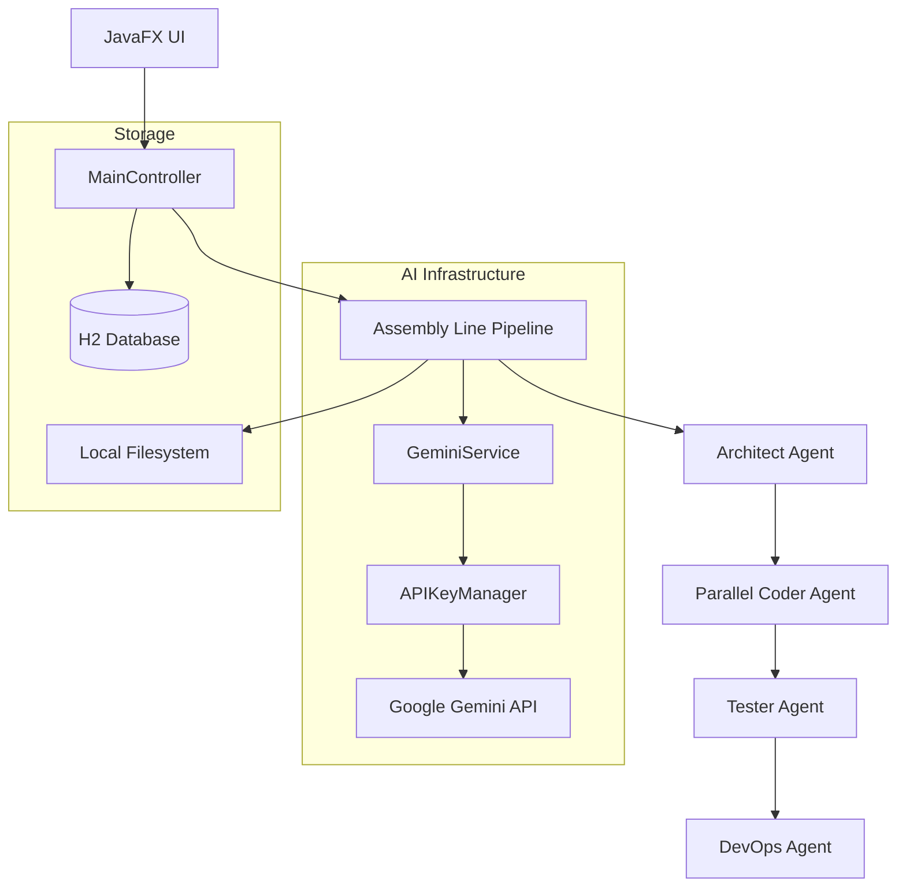
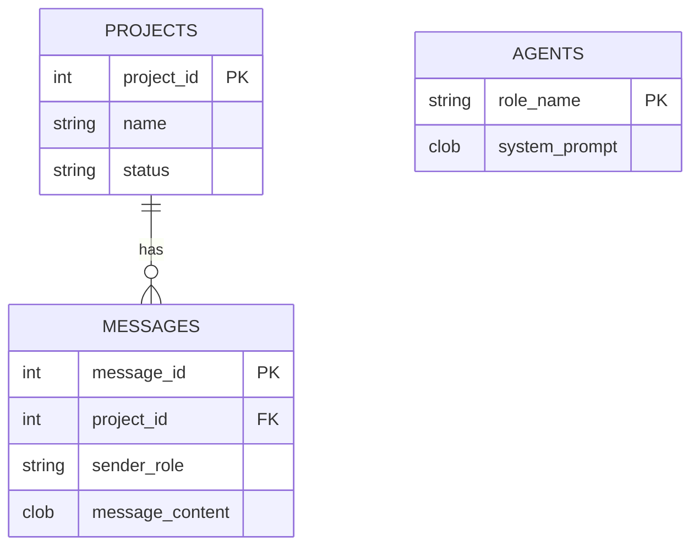

# 🧠 Brain AI - The Autonomous Multi-Agent Assembly Line

**Brain AI** is a powerful, self-contained autonomous agent platform built in Java. It transforms high-level user tasks into fully functional software projects using a multi-agent "Assembly Line" architecture powered by Google's Gemini models.

---

## 🚀 Key Features

- **Multi-Agent Pipeline**: A collaborative workflow between specialized agents:
  - **🏗️ Architect**: Plans the project and detects the type ([JAVA] or [WEB]).
  - **💻 Coder**: Implements raw code (supports parallel sub-tasks).
  - **🔍 Tester**: Recursive code review and self-repair logic.
  - **🌐 DevOps**: Asset validation, dependency management (`npm install`), and documentation.
- **Smart Key Rotation**: Advanced `APIKeyManager` handles multi-key pools, automatic failover for 429 (Rate Limits), and permanent flagging of 401/403 (Invalid) keys.
- **Embedded Database**: H2-backed state management for prompts, project history, and message logs.
- **Hybrid Support**: Native support for Java Swing/JavaFX and Modern Web projects.

---

## 🏗️ Technical Architecture

### System Flow


### Database Schema (Embedded H2)
The application uses an embedded H2 database located at `%USERPROFILE%\.brainai\brainai_db.mv.db`.



| Table | Column | Type | Description |
| :--- | :--- | :--- | :--- |
| **Projects** | `project_id` | INT (AI) | Primary Key |
| | `name` | VARCHAR | Project task name |
| | `status` | VARCHAR | Current state (Active, Completed) |
| **Messages** | `message_id` | INT (AI) | Primary Key |
| | `project_id` | INT | Reference to project |
| | `sender_role` | VARCHAR | Role (Architect, Coder, etc.) |
| | `message_content` | CLOB | Raw AI output or logs |
| **Agents** | `role_name` | VARCHAR | Agent ID (e.g., TESTER) |
| | `system_prompt` | CLOB | The specialized system instruction |

---

## 🛠️ Technology Stack

- **Java 17+**: Core application logic.
- **JavaFX 17+**: Native GUI with CSS-based animations.
- **H2 Database**: Embedded SQL storage with `AUTO_SERVER` mode.
- **Google GenAI SDK**: Direct integration with Gemini models.
- **Wix Toolset**: For building professional Windows MSI installers.

---

## 🛠️ Developer Tools

### Brain AI Manager (`brainai-manager.ps1`)
A comprehensive PowerShell utility for managing the platform:
- **Project Explorer**: Browse history and export agent logs.
- **API Key Validator**: Test Gemini keys against the live API.
- **H2 Console**: Launch the web-based SQL interface.
- **DB Maintenance**: Reset projects or force-refresh system prompts.

**Run it via:**
```powershell
.\brainai-manager.ps1
```

---

## 📥 Installation & Setup

### Prerequisites
1.  **JDK 17+**: Must be in system PATH.
2.  **JavaFX SDK**: Placed in `javafx-sdk/` folder.
3.  **Gemini API Key**: From [Google AI Studio](https://aistudio.google.com/app/apikey).

### Configuration
Brain AI stores configuration in `%USERPROFILE%\.brainai\`:
- `config.properties`: Stores API keys (CSV) and preferred model.
- `brainai_db.mv.db`: Persistent project storage.

---

## 🧩 How It Works (Deep Dive)

### 1. The Assembly Line
When you send a task, a background `Task<Void>` starts the pipeline:
- **Architect** emits `[TYPE: JAVA]` or `[TYPE: WEB]`.
- **Coder** receives a context split into `[SUBTASK]` markers for parallel execution.
- **Tester** performs up to 10 validation/repair attempts if the code fails to compile or has broken assets.

### 2. Multi-Key Management
The `APIKeyManager` implement a "Key Pool" strategy:
- **Parallel Mode**: If multiple keys are provided, Coder sub-tasks run on separate threads using different keys.
- **Rate-Limit Cooling**: If a key hits 429, it is put in a "cooling" state for 65 seconds while the system rotates to the next available key.
- **Invalid Key Handling**: Keys returning 401 or 403 are permanently disabled for the current session.

---

## 👨‍💻 Author
**Ayushman Singh**

---

## ⚖️ License
Educational/Productivity tool. Ensure compliance with Google Gemini's Terms of Service.
